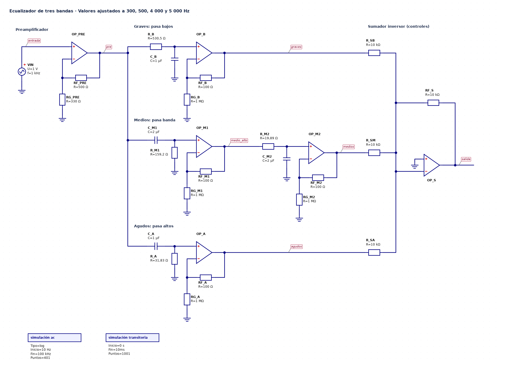

# Ecualizador de audio de tres bandas

Repositorio para ilustrar un ecualizador de tres bandas (Grave, medio y agudo) para una señal de audio, mediante circuitos activos RC y amplificadores operacionales.

Los circuitos electrónicos se generan con esquemas de **[Qucs-S](https://github.com/ra3xdh/qucs_s)**, se simulan con **[Ngspice](https://github.com/ra3xdh/qucs_s)**, se dibujan con **[Python](https://www.python.org/downloads/)** y se modelan con **[Manim](https://github.com/ManimCommunity/manim)**.

## Resumen

Se diseño un ecualizador activo que comprende señales con frecuencias de **300 Hz** (límite superior de graves), **500 - 4.000 Hz** (medios) y **5.000 Hz** (límite inferior de agudos).

<div align="center">
  <table>
    <tr>
      <th>Banda</th>
      <th>Tipo de filtro</th>
      <th>Frecuencias objetivo (−3 dB)</th>
    </tr>
    <tr>
      <td>Graves</td>
      <td>Pasa bajos de primer orden</td>
      <td>300 Hz</td>
    </tr>
    <tr>
      <td>Medios</td>
      <td>Pasa altos + pasa bajos en cascada</td>
      <td>500 Hz y 4 000 Hz</td>
    </tr>
    <tr>
      <td>Agudos</td>
      <td>Pasa altos de primer orden</td>
      <td>5 000 Hz</td>
    </tr>
  </table>
</div>

## Configuración de circuitos

Emplea tres pasos en orden:

1. Generar esquemas editables de Qucs-S (.sch) y dibujarlos con matplotlib.
2. Simularlos con el netlister de Qucs-S y Ngspice.
3. Leer los resultados.

Las figuras y la simulación proceden exactamente del mismo circuito.

**Entrada [1]:**

```python
import sys, warnings
from pathlib import Path
import numpy as np
import matplotlib.pyplot as plt
from IPython.display import Image, display

CARPETA = Path("esquemas").resolve()
RECURSOS = Path("recortes")
RECURSOS.mkdir(exist_ok=True)
sys.path.insert(0, str(CARPETA))
import qucs as q

warnings.filterwarnings("ignore", category=UserWarning)
SERIES = ["#2a78d6", "#eb6834", "#1baf7a", "#eda100"]
TINTA, TINTA_2, REJILLA = "#0b0b0b", "#52514e", "#e4e3df"
plt.rcParams.update({
    "figure.facecolor": "#fcfcfb", "axes.facecolor": "#fcfcfb",
    "axes.edgecolor": "#b9b8b3", "axes.labelcolor": TINTA_2,
    "xtick.color": TINTA_2, "ytick.color": TINTA_2, "axes.grid": True,
    "grid.color": REJILLA, "grid.linewidth": 0.8, "lines.linewidth": 2,
    "axes.spines.top": False, "axes.spines.right": False,
    "font.size": 10, "axes.titlesize": 12, "axes.titleweight": "bold",
    "axes.titlelocation": "left", "legend.frameon": False,
})

def mostrar(fig, nombre, dpi=130):
    ruta = RECURSOS / f"{nombre}.png"
    fig.savefig(ruta, dpi=dpi, bbox_inches="tight", facecolor=fig.get_facecolor())
    plt.close(fig)
    display(Image(filename=str(ruta)), metadata={"archivo": ruta.as_posix()})

def es(x, dec=2):
    texto = f"{x:,.{dec}f}".replace(",", " ").replace(".", ",")
    return texto

rutas = q.generar_todos(CARPETA)
print(f"{'Archivo':<24} {'R graves':>9} {'R medios inf.':>13} {'R medios sup.':>13} {'R agudos':>9}  Sumador (G, M, A)")
for ruta, (nombre, (rc, suma, desc)) in zip(rutas, q.VARIANTES.items()):
    print(f"{ruta.name:<24} {rc['R_B']:>9} {rc['R_M1']:>13} {rc['R_M2']:>13} {rc['R_A']:>9}  {', '.join(suma)}")
```

Se generan seis variantes del mismo circuito:

**Salida [1]:**

```text
Archivo                   R graves R medios inf. R medios sup.  R agudos  Sumador (G, M, A)
01_original.sch                270           150            18        33  10k, 10k, 10k
02_ajustado.sch              530.5        159.15         19.89     31.83  10k, 10k, 10k
03_comercial_E96.sch           536           158            20      31.6  10k, 10k, 10k
04_realce_graves.sch         530.5        159.15         19.89     31.83  5k, 20k, 20k
05_realce_medios.sch         530.5        159.15         19.89     31.83  20k, 5k, 20k
06_realce_agudos.sch         530.5        159.15         19.89     31.83  20k, 20k, 5k
```

### Circuito completo

**Entrada [2]:**

```python
fig = q.dibujar_sch(CARPETA / "02_ajustado.sch", escala=0.95)
mostrar(fig, "c01_ecualizador_completo", dpi=120)
```

**Salida [2]:**



*Figura 1. Esquema Qucs-S completo con los valores ajustados de los bloques de simulación AC (10 Hz–100 kHz, 401 puntos) y transitoria (10 ms).*

La salida del preamplificador, alimenta un bus común a las tres ramas. Cada red RC excita la entrada no inversora de un amplificador operacional con $R_G=1\,\mathrm{M}\Omega$ y $R_F=100\,\Omega$ ($K\approx1{,}0001$), que la aísla de la carga. Las salidas llegan al nodo de suma del inversor a través de $R_{SB}$, $R_{SM}$ y $R_{SA}$, que son los controles de banda.
