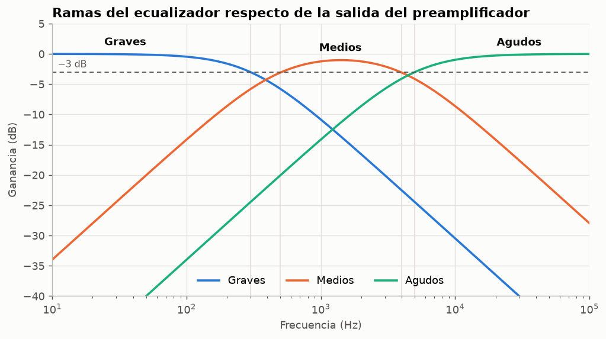
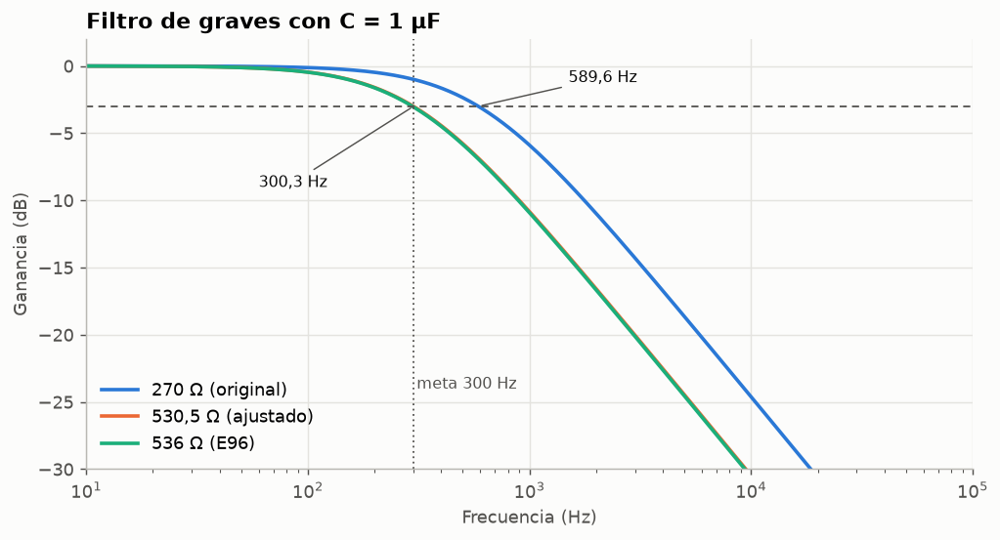
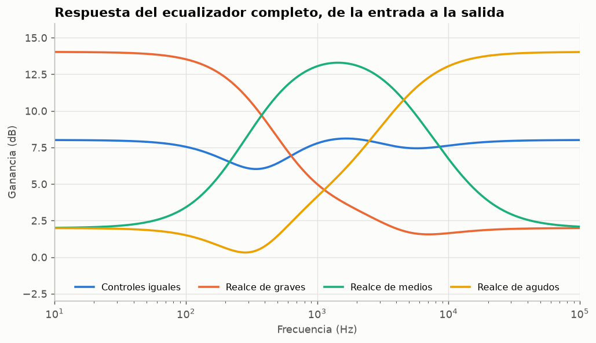
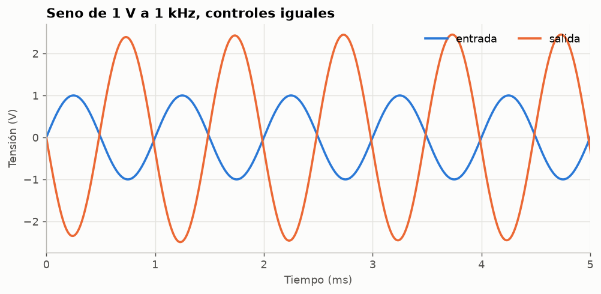
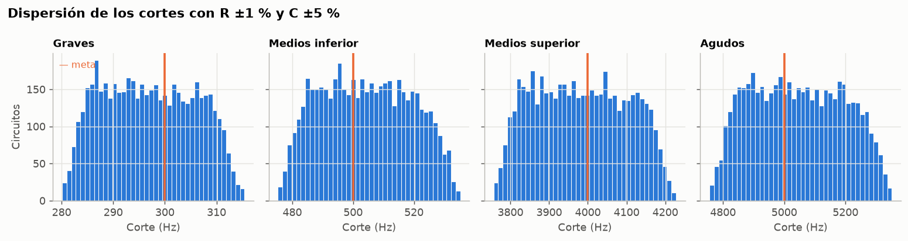
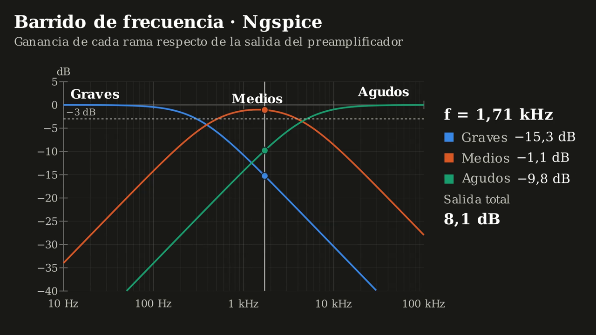

# Ecualizador de audio de tres bandas

Repositorio para ilustrar un ecualizador de tres bandas (Grave, medio y agudo) para una señal de audio, mediante circuitos activos RC y amplificadores operacionales.

Los circuitos electrónicos se generan con esquemas de **[Qucs-S](https://github.com/ra3xdh/qucs_s)**, se simulan con **[Ngspice](https://github.com/ra3xdh/qucs_s)**, se dibujan con **[Python](https://www.python.org/downloads/)** y se modelan con **[Manim](https://github.com/ManimCommunity/manim)**.

## Resumen

Se diseño un ecualizador activo que comprende señales con frecuencias de **300 Hz** (límite superior de graves), **500 - 4.000 Hz** (medios) y **5.000 Hz** (límite inferior de agudos).

<div align="center">
  <table>
    <tr>
      <th>Banda</th>
      <th>Tipo de filtro</th>
      <th>Frecuencias objetivo (−3 dB)</th>
    </tr>
    <tr>
      <td>Graves</td>
      <td>Pasa bajos de primer orden</td>
      <td>300 Hz</td>
    </tr>
    <tr>
      <td>Medios</td>
      <td>Pasa altos + pasa bajos en cascada</td>
      <td>500 Hz y 4 000 Hz</td>
    </tr>
    <tr>
      <td>Agudos</td>
      <td>Pasa altos de primer orden</td>
      <td>5 000 Hz</td>
    </tr>
  </table>
</div>

## Configuración de circuitos

Emplea tres pasos en orden:

1. Generar esquemas editables de Qucs-S (.sch) y dibujarlos con matplotlib.
2. Simularlos con el netlister de Qucs-S y Ngspice.
3. Leer los resultados.

Las figuras y la simulación proceden exactamente del mismo circuito.

**Entrada [1]:**

```python
import sys, warnings
from pathlib import Path
import numpy as np
import matplotlib.pyplot as plt
from IPython.display import Image, display

CARPETA = Path("esquemas").resolve()
RECURSOS = Path("recortes")
RECURSOS.mkdir(exist_ok=True)
sys.path.insert(0, str(CARPETA))
import qucs as q

warnings.filterwarnings("ignore", category=UserWarning)
SERIES = ["#2a78d6", "#eb6834", "#1baf7a", "#eda100"]
TINTA, TINTA_2, REJILLA = "#0b0b0b", "#52514e", "#e4e3df"
plt.rcParams.update({
    "figure.facecolor": "#fcfcfb", "axes.facecolor": "#fcfcfb",
    "axes.edgecolor": "#b9b8b3", "axes.labelcolor": TINTA_2,
    "xtick.color": TINTA_2, "ytick.color": TINTA_2, "axes.grid": True,
    "grid.color": REJILLA, "grid.linewidth": 0.8, "lines.linewidth": 2,
    "axes.spines.top": False, "axes.spines.right": False,
    "font.size": 10, "axes.titlesize": 12, "axes.titleweight": "bold",
    "axes.titlelocation": "left", "legend.frameon": False,
})

def mostrar(fig, nombre, dpi=130):
    ruta = RECURSOS / f"{nombre}.png"
    fig.savefig(ruta, dpi=dpi, bbox_inches="tight", facecolor=fig.get_facecolor())
    plt.close(fig)
    display(Image(filename=str(ruta)), metadata={"archivo": ruta.as_posix()})

def es(x, dec=2):
    texto = f"{x:,.{dec}f}".replace(",", " ").replace(".", ",")
    return texto

rutas = q.generar_todos(CARPETA)
print(f"{'Archivo':<24} {'R graves':>9} {'R medios inf.':>13} {'R medios sup.':>13} {'R agudos':>9}  Sumador (G, M, A)")
for ruta, (nombre, (rc, suma, desc)) in zip(rutas, q.VARIANTES.items()):
    print(f"{ruta.name:<24} {rc['R_B']:>9} {rc['R_M1']:>13} {rc['R_M2']:>13} {rc['R_A']:>9}  {', '.join(suma)}")
```

Se generan seis variantes del mismo circuito:

**Salida [1]:**

```text
Archivo                   R graves R medios inf. R medios sup.  R agudos  Sumador (G, M, A)
01_original.sch                270           150            18        33  10k, 10k, 10k
02_ajustado.sch              530.5        159.15         19.89     31.83  10k, 10k, 10k
03_comercial_E96.sch           536           158            20      31.6  10k, 10k, 10k
04_realce_graves.sch         530.5        159.15         19.89     31.83  5k, 20k, 20k
05_realce_medios.sch         530.5        159.15         19.89     31.83  20k, 5k, 20k
06_realce_agudos.sch         530.5        159.15         19.89     31.83  20k, 20k, 5k
```

### Circuito completo

**Entrada [2]:**

```python
fig = q.dibujar_sch(CARPETA / "02_ajustado.sch", escala=0.95)
mostrar(fig, "c01_ecualizador_completo", dpi=120)
```

**Salida [2]:**


*Figura 1. Esquema Qucs-S completo con los valores ajustados de los bloques de simulación AC (10 Hz–100 kHz, 401 puntos) y transitoria (10 ms).*

La salida del preamplificador, alimenta un bus común a las tres ramas. Cada red RC excita la entrada no inversora de un amplificador operacional con $R_G=1\,\mathrm{M}\Omega$ y $R_F=100\,\Omega$ ($K\approx1{,}0001$), que la aísla de la carga. Las salidas llegan al nodo de suma del inversor a través de $R_{SB}$, $R_{SM}$ y $R_{SA}$, que son los controles de banda.

### Etapas ampliadas

La misma función recorta el esquema completo por regiones. Las figuras 2 a 6 no son dibujos independientes: salen del mismo archivo `02_ajustado.sch`.

**Entrada [3]:**

```python
etapas = {
    "preamplificador": "Preamplificador no inversor · K = 1 + 500/330",
    "graves": "Graves · pasa bajos RC + buffer",
    "medios": "Medios · pasa altos (500 Hz) y pasa bajos (4 kHz) en cascada",
    "agudos": "Agudos · pasa altos RC + buffer",
    "sumador": "Sumador inversor · controles de banda",
}
for i, (clave, titulo) in enumerate(etapas.items(), start=2):
    fig = q.dibujar_sch(CARPETA / "02_ajustado.sch", vista=q.VISTAS[clave],
                        escala=1.35, titulo=titulo, simulaciones=False)
    mostrar(fig, f"c{i:02d}_{clave}", dpi=110)
```

**Salida [3]:**


*Figuras 2 a 6. Preamplificador, rama de graves, rama de medios, rama de agudos y sumador inversor, en ese orden.*

## Modelo analítico

**Preamplificador.** Con realimentación negativa, la ganancia no inversora es $K=1+R_F/R_G=1+500/330\approx2{,}515$.

**Filtros.** Cada red RC tiene su corte en $f_c=\dfrac{1}{2\pi RC}$. Con el buffer de ganancia $K$:

$$H_{PB}(s)=\frac{K}{1+sRC},\qquad H_{PA}(s)=K\,\frac{sRC}{1+sRC},\qquad H_M(s)=H_{PA}(s)\,H_{PB}(s).$$

**Sumador.** Con resistencias de entrada $R_i$ y realimentación $R_F$:

$$V_o=-R_F\left(\frac{V_G}{R_{SB}}+\frac{V_M}{R_{SM}}+\frac{V_A}{R_{SA}}\right).$$

La celda calcula los cortes teóricos de las tres variantes de componentes:

**Entrada [4]:**

```python
LIMITES = [("Graves", "R_B", "C_B", 300), ("Medios inferior", "R_M1", "C_M1", 500),
           ("Medios superior", "R_M2", "C_M2", 4000), ("Agudos", "R_A", "C_A", 5000)]
DISENOS = {"Original": q.ORIGINAL, "Ajustado": q.AJUSTADO, "E96": q.COMERCIAL}

def fc(rc, r, c):
    return 1 / (2 * np.pi * q.valor(rc[r]) * q.valor(rc[c]))

print(f"{'Límite':<16}{'Meta':>8}" + "".join(f"{d:>12}" for d in DISENOS) + "   (Hz, analítico)")
for nombre, r, c, meta in LIMITES:
    print(f"{nombre:<16}{meta:>8}" + "".join(f"{es(fc(rc, r, c)):>12}" for rc in DISENOS.values()))
```

**Salida [4]:**

```text
Límite              Meta    Original    Ajustado         E96   (Hz, analítico)
Graves               300      589,46      300,01      296,93
Medios inferior      500      530,52      500,02      503,65
Medios superior    4.000    4.420,97    4.000,88    3.978,87
Agudos             5.000    4.822,88    5.000,16    5.036,55
```

## Frecuencias de corte simuladas

Cada corte se mide a −3 dB de la ganancia de paso de su etapa: graves y agudos respecto del preamplificador, el límite inferior de medios bajos y el superior con medios altos.

**Entrada [5]:**

```python
def cortes(a):
    f = a["frequency"]
    return [q.corte(f, a["graves"] / a["pre"], sube=False),
            q.corte(f, a["medio_alto"] / a["pre"], sube=True),
            q.corte(f, a["medios"] / a["medio_alto"], sube=False),
            q.corte(f, a["agudos"] / a["pre"], sube=True)]

tabla = {"Original": cortes(sim["01_original"]["ac"]),
         "Ajustado": cortes(sim["02_ajustado"]["ac"]),
         "E96": cortes(sim["03_comercial_E96"]["ac"])}
print(f"{'Límite':<16}{'Meta':>8}" + "".join(f"{d:>12}" for d in tabla) + "   error E96")
for i, (nombre, _, _, meta) in enumerate(LIMITES):
    err = 100 * (tabla["E96"][i] / meta - 1)
    print(f"{nombre:<16}{meta:>8}" + "".join(f"{es(v[i]):>12}" for v in tabla.values())
          + f"   {err:+.1f} %".replace(".", ","))
```

**Salida [5]:**

```text
Límite              Meta    Original    Ajustado         E96   error E96
Graves               300      589,63      300,34      297,26   -0,9 %
Medios inferior      500      530,52      500,01      503,65   +0,7 %
Medios superior    4.000    4.420,85    4.000,81    3.978,89   -0,5 %
Agudos             5.000    4.811,81    4.987,81    5.023,88   +0,5 %
```

Los valores ajustados alcanzan las metas con un error inferior al 0,3 %. Con resistencias E96 el error máximo es del 1 %, del mismo orden que la tolerancia de esos componentes.

## Respuesta de las ramas del ecualizador

**Entrada [6]:**

```python
a = sim["02_ajustado"]["ac"]
f = a["frequency"]
db = lambda h: 20 * np.log10(np.abs(h))
ramas = [("Graves", a["graves"] / a["pre"]), ("Medios", a["medios"] / a["pre"]),
         ("Agudos", a["agudos"] / a["pre"])]

fig, ax = plt.subplots(figsize=(9, 4.6))
for (nombre, h), color in zip(ramas, SERIES):
    ax.semilogx(f, db(h), color=color, label=nombre)
ax.axhline(-3, color=TINTA_2, lw=1, ls=(0, (4, 3)))
ax.text(11, -2.2, "−3 dB", color=TINTA_2, fontsize=9)
for (nombre, h), color, x in zip(ramas, SERIES, (35, 1400, 30000)):
    ax.text(x, db(h)[np.argmin(abs(f - x))] + 1.5, nombre, color=TINTA, fontsize=10,
            ha="center", fontweight="bold")
for fc_sim in tabla["Ajustado"]:
    ax.axvline(fc_sim, color=REJILLA, lw=1.2, zorder=0)
ax.set(xlim=(10, 1e5), ylim=(-40, 5), xlabel="Frecuencia (Hz)", ylabel="Ganancia (dB)",
       title="Ramas del ecualizador respecto de la salida del preamplificador")
ax.legend(loc="lower center", ncol=3)
mostrar(fig, "g01_respuesta_ramas")
```

**Salida [6]:**



*Figura 7. Respuesta AC de las tres ramas (Ngspice). Las líneas verticales marcan los cuatro cortes simulados.*

La banda media es ancha: su máximo, −1,0 dB cerca de 1,4 kHz, queda por debajo de 0 dB porque sus dos etapas ya atenúan un poco en el centro. Graves y medios se cruzan en 380 Hz a −4,2 dB, y medios y agudos en 4,4 kHz a −3,5 dB.

## Corrección del filtro de graves

**Entrada [7]:**

```python
fig, ax = plt.subplots(figsize=(9, 4.4))
for (nombre, clave), color in zip([("270 Ω (original)", "01_original"),
                                   ("530,5 Ω (ajustado)", "02_ajustado"),
                                   ("536 Ω (E96)", "03_comercial_E96")], SERIES):
    b = sim[clave]["ac"]
    ax.semilogx(b["frequency"], db(b["graves"] / b["pre"]), color=color, label=nombre)
ax.axhline(-3, color=TINTA_2, lw=1, ls=(0, (4, 3)))
ax.axvline(300, color=TINTA_2, lw=1, ls=(0, (1, 2)))
ax.annotate(f"{es(tabla['Original'][0], 1)} Hz", (tabla["Original"][0], -3), (1500, -1.2),
            arrowprops=dict(arrowstyle="-", color=TINTA_2, lw=0.8), fontsize=9, color=TINTA)
ax.annotate(f"{es(tabla['Ajustado'][0], 1)} Hz", (tabla["Ajustado"][0], -3), (60, -9),
            arrowprops=dict(arrowstyle="-", color=TINTA_2, lw=0.8), fontsize=9, color=TINTA)
ax.text(310, -24, "meta 300 Hz", color=TINTA_2, fontsize=9)
ax.set(xlim=(10, 1e5), ylim=(-30, 2), xlabel="Frecuencia (Hz)", ylabel="Ganancia (dB)",
       title="Filtro de graves con C = 1 µF")
ax.legend(loc="lower left")
mostrar(fig, "g02_correccion_graves")
```

**Salida [7]:**



*Figura 8. Con 270 Ω el corte está en 589,6 Hz. Las curvas de 530,5 Ω y 536 Ω casi se superponen, porque sus cortes difieren sólo en 1 %.*

## Efecto de los controles

Para destacar una banda se reduce su resistencia de entrada del sumador a **5 kΩ** (peso $R_F/R_i=2$) y se elevan las otras a **20 kΩ** (peso 0,5). Esta respuesta se mide de la entrada a la salida, así que incluye la ganancia del preamplificador.

**Entrada [8]:**

```python
ajustes = [("Controles iguales", "02_ajustado"), ("Realce de graves", "04_realce_graves"),
           ("Realce de medios", "05_realce_medios"), ("Realce de agudos", "06_realce_agudos")]
fig, ax = plt.subplots(figsize=(9, 4.8))
print(f"{'Ajuste':<20}{'100 Hz':>10}{'1 kHz':>10}{'10 kHz':>10}   (dB)")
for (nombre, clave), color in zip(ajustes, SERIES):
    b = sim[clave]["ac"]
    g = db(b["salida"] / b["entrada"])
    ax.semilogx(b["frequency"], g, color=color, label=nombre)
    valores = [g[np.argmin(abs(b["frequency"] - x))] for x in (100, 1000, 10000)]
    print(f"{nombre:<20}" + "".join(f"{es(v):>10}" for v in valores))
ax.set(xlim=(10, 1e5), ylim=(-3, 16), xlabel="Frecuencia (Hz)", ylabel="Ganancia (dB)",
       title="Respuesta del ecualizador completo, de la entrada a la salida")
ax.legend(loc="lower center", ncol=4, fontsize=9)
mostrar(fig, "g03_controles")
```

**Salida [8]:**

```text
Ajuste                  100 Hz     1 kHz    10 kHz   (dB)
Controles iguales         7,55      7,78      7,62
Realce de graves         13,53      5,00      1,64
Realce de medios          3,41     13,05      6,73
Realce de agudos          1,50      4,14     13,06
```



*Figura 9. Los cuatro ajustes del sumador simulados en Ngspice.*

Con controles iguales la respuesta varía entre 6,0 y 8,1 dB. La depresión de unos 2 dB cerca de 340 Hz aparece donde graves y medios se cruzan con fases distintas, por lo que no se suman en módulo; cerca de 5,8 kHz ocurre lo mismo con medios y agudos, pero la caída es menor (7,4 dB). Cada realce eleva su banda entre 5,3 y 6,0 dB por encima del ajuste plano y atenúa las otras dos.

## Respuesta temporal

**Entrada [9]:**

```python
t = sim["02_ajustado"]["tr"]
fig, ax = plt.subplots(figsize=(9, 3.8))
ax.plot(t["time"] * 1e3, t["entrada"], color=SERIES[0], label="entrada")
ax.plot(t["time"] * 1e3, t["salida"], color=SERIES[1], label="salida")
ax.set(xlim=(0, 5), xlabel="Tiempo (ms)", ylabel="Tensión (V)",
       title="Seno de 1 V a 1 kHz, controles iguales")
ax.legend(loc="upper right", ncol=2)
mostrar(fig, "g04_transitorio")
estable = t["time"] > 5e-3
print(f"Amplitud de salida en régimen: {es(np.max(np.abs(t['salida'][estable])))} V "
      f"(ganancia {es(20*np.log10(np.max(np.abs(t['salida'][estable]))))} dB)")
```

**Salida [9]:**

```text
Amplitud de salida en régimen: 2,45 V (ganancia 7,78 dB)
```



*Figura 10. La salida está invertida por el sumador y su amplitud queda lejos del límite de ±15 V del operacional.*

## Contraste entre Python y Ngspice

El modelo analítico se evalúa en las mismas 401 frecuencias que la simulación. Si ambos coinciden, la netlist generada por Qucs-S representa el circuito previsto.

**Entrada [10]:**

```python
K_PRE, K_BUF = 1 + 500 / 330, 1 + 100 / 1e6

def modelo(f, rc, suma):
    s = 2j * np.pi * f
    pb = lambda r, c: K_BUF / (1 + s * q.valor(rc[r]) * q.valor(rc[c]))
    pa = lambda r, c: K_BUF * s * q.valor(rc[r]) * q.valor(rc[c]) / (1 + s * q.valor(rc[r]) * q.valor(rc[c]))
    ramas = (pb("R_B", "C_B"), pa("R_M1", "C_M1") * pb("R_M2", "C_M2"), pa("R_A", "C_A"))
    return -K_PRE * sum(10e3 / q.valor(r) * h for r, h in zip(suma, ramas))

print(f"{'Variante':<20}{'error máx. (dB)':>16}{'error máx. fase (°)':>20}")
for nombre, (rc, suma, _) in q.VARIANTES.items():
    b = sim[nombre]["ac"]
    h_py, h_sp = modelo(b["frequency"], rc, suma), b["salida"] / b["entrada"]
    e_mag = np.max(np.abs(db(h_py) - db(h_sp)))
    e_fase = np.max(np.abs(np.angle(h_py / h_sp, deg=True)))
    print(f"{nombre:<20}{es(e_mag, 4):>16}{es(e_fase, 4):>20}")
```

**Salida [10]:**

```text
Variante             error máx. (dB) error máx. fase (°)
01_original                   0,0001              0,0000
02_ajustado                   0,0001              0,0000
03_comercial_E96              0,0001              0,0000
04_realce_graves              0,0001              0,0000
05_realce_medios              0,0001              0,0000
06_realce_agudos              0,0001              0,0000
```

La diferencia no supera 0,0001 dB en todo el barrido ni en ninguna de las seis variantes. Ese residuo procede de la ganancia finita ($10^6$) del operacional de Qucs-S. Ambos modelos describen, por tanto, el mismo circuito.

## Tolerancias: análisis de Monte Carlo

Los componentes reales se desvían de su valor nominal. Se sortean circuitos con las resistencias E96 (±1 %) y condensadores de ±5 %, con distribución uniforme, y se calcula el corte de cada filtro.

**Entrada [11]:**

```python
rng = np.random.default_rng(2026)
N = 5000
fig, ejes = plt.subplots(1, 4, figsize=(12, 3.2), sharey=True)
print(f"{'Límite':<16}{'nominal':>10}{'P5':>10}{'P95':>10}   (Hz)")
for ax, (nombre, r, c, meta) in zip(ejes, LIMITES):
    R = q.valor(q.COMERCIAL[r]) * rng.uniform(0.99, 1.01, N)
    C = q.valor(q.COMERCIAL[c]) * rng.uniform(0.95, 1.05, N)
    cortes_mc = 1 / (2 * np.pi * R * C)
    ax.hist(cortes_mc, bins=40, color=SERIES[0], edgecolor="#fcfcfb", linewidth=0.6)
    ax.axvline(meta, color=SERIES[1], lw=2)
    ax.set_title(nombre, fontsize=10)
    ax.set_xlabel("Corte (Hz)")
    p5, p95 = np.percentile(cortes_mc, [5, 95])
    print(f"{nombre:<16}{es(fc(q.COMERCIAL, r, c), 0):>10}{es(p5, 0):>10}{es(p95, 0):>10}")
ejes[0].set_ylabel("Circuitos")
ejes[0].text(0.03, 0.95, "— meta", color=SERIES[1], transform=ejes[0].transAxes, fontsize=9, va="top")
fig.suptitle("Dispersión de los cortes con R ±1 % y C ±5 %", x=0.01, ha="left", fontweight="bold")
fig.tight_layout()
mostrar(fig, "g05_montecarlo")
```

**Salida [11]:**

```text
Límite             nominal        P5       P95   (Hz)
Graves                 297       284       311
Medios inferior        504       482       528
Medios superior      3.979     3.803     4.169
Agudos               5.037     4.819     5.281
```



*Figura 11. Distribución de los cortes en circuitos simulados. La línea naranja marca la meta.*

En cada filtro, el 90 % de los circuitos queda entre −5,3 % y +5,6 % de la meta. La tolerancia de los condensadores domina la dispersión: pasar a condensadores de ±1 % tendría más efecto que afinar las resistencias.

## Animaciones con Manim

Los resultados de Ngspice se animaron con [Manim Community](https://www.manim.community/) 0.21 en el script [`animaciones_manim.py`](Ecualizador_QucsS_V3/animaciones_manim.py). Cada escena lee los archivos de texto de `simulaciones/`; sólo el barrido continuo de $R_B$ de la animación 2 usa la función de transferencia analítica, que coincide con los modelos con Ngspice. Los vídeos están en 1080p a 60 fps y se reproducen dentro del informe. Debajo de cada uno hay un enlace directo al archivo MP4.

| # | Escena | Qué muestra | Duración |
|---|---|---|---: |
| 1 | `BarridoBandas` | Un cursor recorre de 10 Hz a 100 kHz y lee la ganancia de cada rama y de la salida; al final marca los cuatro cortes. | 24 s |
| 2 | `CorreccionGraves` | $R_B$ crece de 270 Ω a 530,5 Ω y el corte baja de 589,6 Hz a 300 Hz; se superponen las curvas de Ngspice, incluida la E96. | 17 s |
| 3 | `ControlesSumador` | La respuesta total cambia entre los cuatro ajustes, con barras que muestran el peso $10\,\mathrm{k}\Omega/R_i$ de cada banda. | 20 s |
| 4 | `SenalTransitoria` | Un seno de 1 kHz recorre las etapas: entrada, preamplificador, tres ramas y salida invertida. | 14 s |


<video src="animaciones/m1_BarridoBandas.mp4" poster="animaciones/m1_BarridoBandas.png" controls loop muted playsinline width="100%" title="Animación 1: barrido de frecuencia"></video>

▶ [Animación 1: barrido de frecuencia (MP4, 1080p60)](animaciones/m1_BarridoBandas.mp4)

*Animación 1. Barrido de frecuencia sobre las tres ramas.* [](animaciones/m1_BarridoBandas.mp4)

<video src="animaciones/m2_CorreccionGraves.mp4" poster="animaciones/m2_CorreccionGraves.png" controls loop muted playsinline width="100%" title="Animación 2: corrección del filtro de graves"></video>

▶ [Animación 2: corrección del filtro de graves (MP4, 1080p60)](animaciones/m2_CorreccionGraves.mp4)

*Animación 2. Desplazamiento del corte de graves al aumentar $R_B$.*

<video src="animaciones/m3_ControlesSumador.mp4" poster="animaciones/m3_ControlesSumador.png" controls loop muted playsinline width="100%" title="Animación 3: controles del sumador"></video>

▶ [Animación 3: controles del sumador (MP4, 1080p60)](animaciones/m3_ControlesSumador.mp4)

*Animación 3. Respuesta del ecualizador en los cuatro ajustes del sumador.*

<video src="animaciones/m4_SenalTransitoria.mp4" poster="animaciones/m4_SenalTransitoria.png" controls loop muted playsinline width="100%" title="Animación 4: señal a 1 kHz"></video>

▶ [Animación 4: señal a 1 kHz (MP4, 1080p60)](animaciones/m4_SenalTransitoria.mp4)

*Animación 4. Simulación transitoria: la salida es la suma invertida de las tres ramas.*

Para volver a generar las animaciones:

```bash
python -m manim -qh animaciones_manim.py BarridoBandas CorreccionGraves ControlesSumador SenalTransitoria
```
